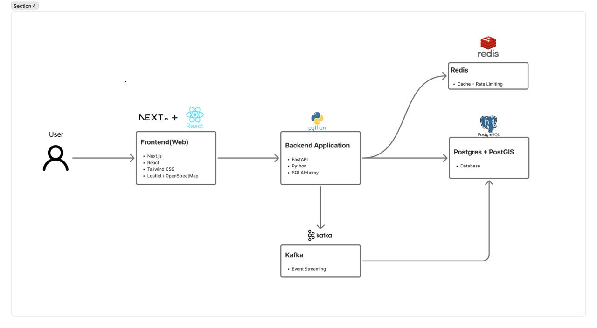
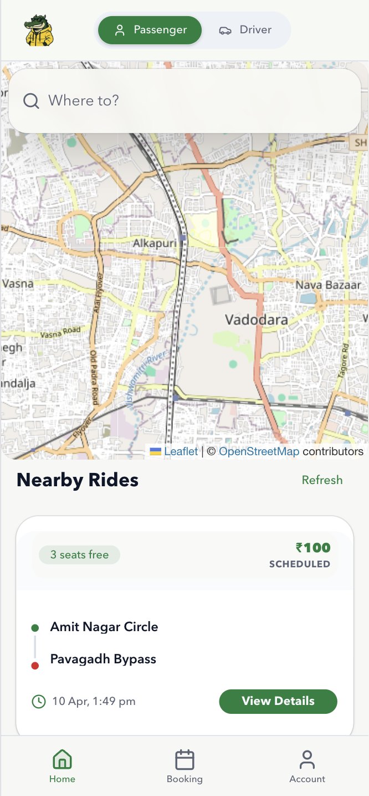
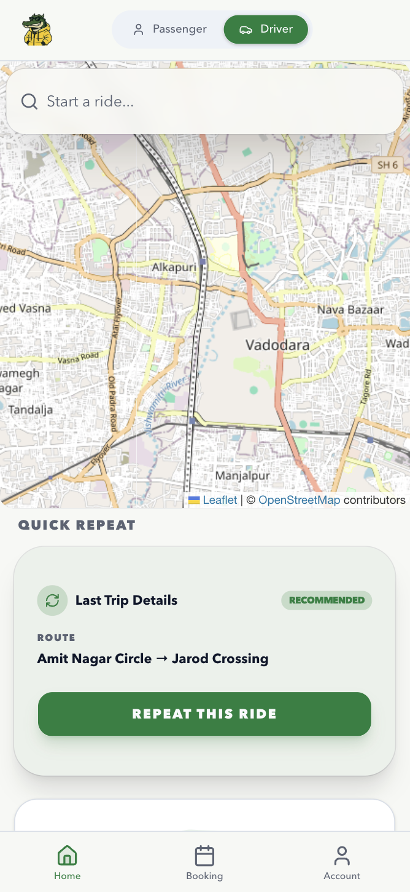
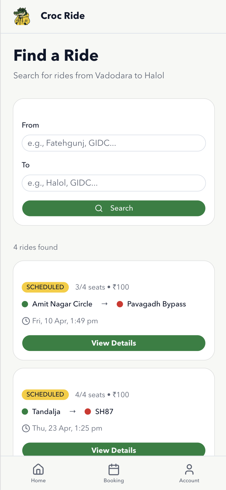
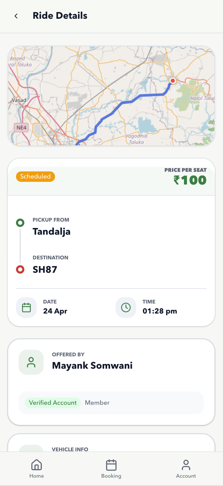
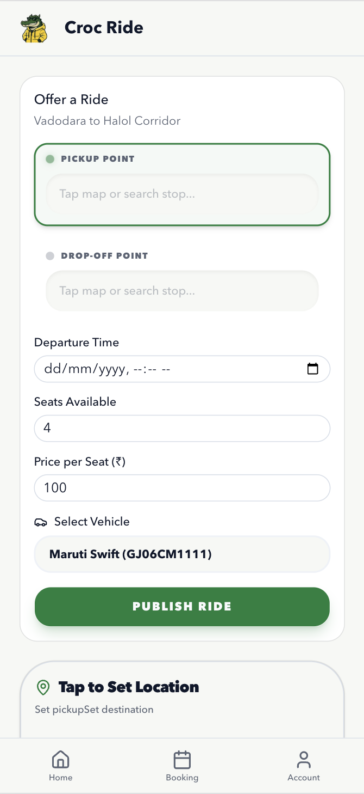
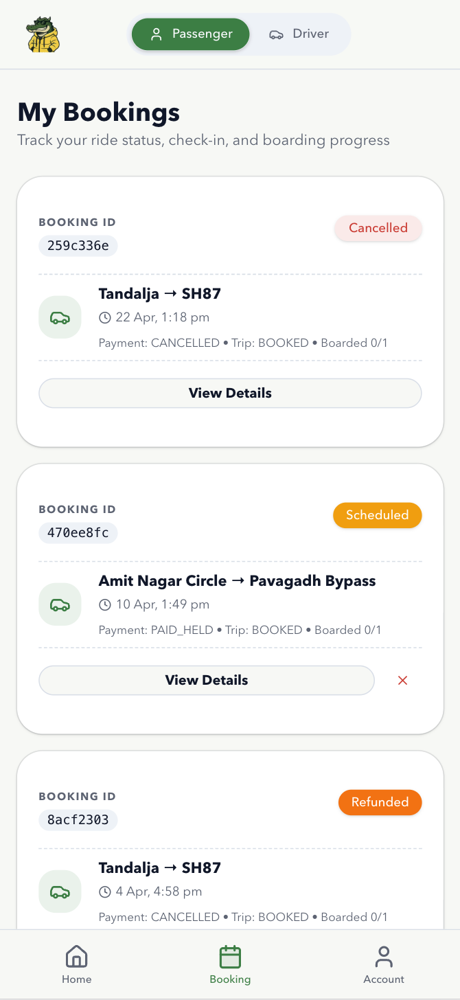
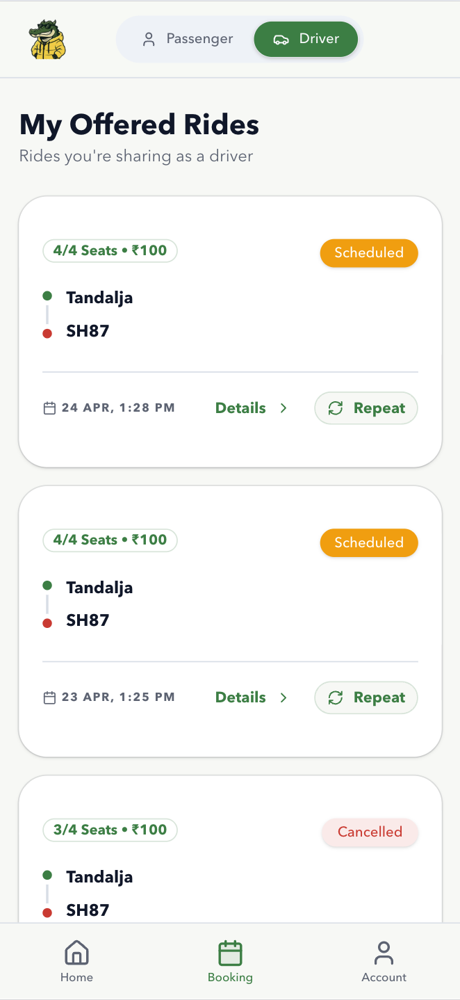
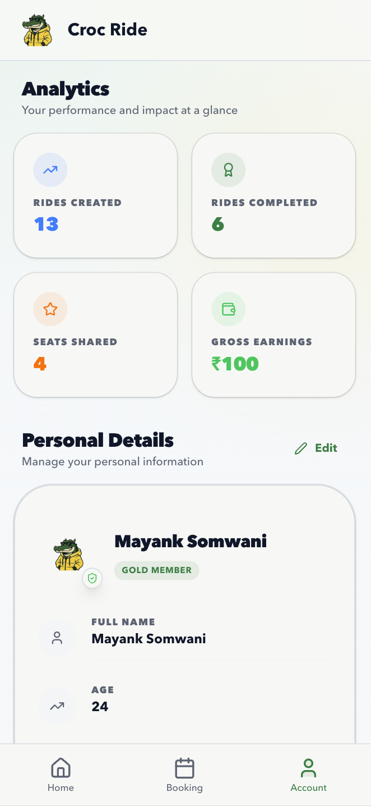

<div align="center">
  <h1>Carpooling System</h1>
  <p>A community-focused carpooling platform for the Vadodara-Halol corridor.</p>
</div>

---

## About The Project

**Croc Ride** is a carpooling application built for repeat commuters traveling between **Vadodara and Halol**. The platform helps drivers offer rides and passengers discover, book, and pay for shared trips along the same corridor.

The project combines:

- **Next.js + React** for the frontend
- **FastAPI + Python** for the backend
- **PostgreSQL + PostGIS** for ride and geospatial data
- **Redis** for caching and rate limiting
- **Kafka + background workers** for asynchronous event processing
- **Google OAuth** for authentication
- **Razorpay** for payment flows

## Key Features

- **Ride creation and discovery** with route-based search
- **Geospatial ride matching** using PostGIS and stored route geometry
- **Cookie-based Google OAuth login**
- **Vehicle management** for drivers
- **Seat booking flow** with concurrency-safe booking logic
- **Payment order, verification, refund, and settlement flows** with Razorpay
- **Redis-backed rate limiting** on state-changing endpoints
- **Outbox-pattern event publishing** with Kafka workers
- **Passenger and driver dashboards** for bookings, rides, and analytics

## Tech Stack

- **Frontend:** Next.js 16, React 19, Tailwind CSS, Leaflet, OpenStreetMap
- **Backend:** FastAPI, Python 3.11, SQLAlchemy, Alembic
- **Database:** PostgreSQL + PostGIS
- **Cache / Limits:** Redis
- **Messaging:** Apache Kafka + Zookeeper
- **Payments:** Razorpay
- **Authentication:** Google OAuth
- **Deployment / Local Dev:** Docker Compose

## System Architecture

The application follows a **modular monolith** architecture for the core backend, supported by **Kafka-based background workers** for asynchronous processing.



### Architecture Summary

- The **frontend** is a Next.js application that serves the user-facing experience for searching rides, booking seats, creating rides, and managing profiles.
- The **backend API** is a FastAPI application that handles authentication, rides, bookings, vehicles, payments, analytics, and notifications.
- **PostgreSQL + PostGIS** acts as the system of record for users, rides, bookings, vehicles, and spatial route data.
- **Redis** is used for caching and rate limiting.
- **Kafka** carries asynchronous events generated by booking and ride actions.
- **Workers** process outbox events, booking history events, and notification events.
- **Google OAuth** is used for sign-in.
- **Razorpay** is used for payment, refund, and payout-account flows.

## Application Screenshots

<table>
  <tr>
    <td align="center">
      <br/>
      <sub>Home Page - Passenger</sub>
    </td>
    <td align="center">
      <br/>
      <sub>Home Page - Driver</sub>
    </td>
    <td align="center">
      <br/>
      <sub>Search Ride Page</sub>
    </td>
  </tr>
  <tr>
    <td align="center">
      <br/>
      <sub>Ride Details Page</sub>
    </td>
    <td align="center">
      <br/>
      <sub>Create Ride Page</sub>
    </td>
    <td align="center">
      <br/>
      <sub>Booking Page - Passenger</sub>
    </td>
  </tr>
  <tr>
    <td align="center">
      <br/>
      <sub>Booking Page - Driver</sub>
    </td>
    <td align="center">
      <br/>
      <sub>Account Page</sub>
    </td>
    <td></td>
  </tr>
</table>

## Getting Started

Because this project depends on **PostgreSQL/PostGIS, Redis, Kafka, and multiple workers**, the easiest way to run it locally is with Docker Compose.

### Prerequisites

- Docker Desktop
- Docker Compose

### Environment Setup

1. Copy the root environment template:

```bash
cp .env.example .env
```

2. Update the values in `.env`.

Important variables used by the Docker-based setup include:

```env
POSTGRES_DB=carpooling_db
POSTGRES_USER=your_postgres_user
POSTGRES_PASSWORD=your_strong_postgres_password
JWT_SECRET=replace_with_a_strong_random_secret
REDIS_PASSWORD=your_strong_redis_password
REDIS_URL=redis://:${REDIS_PASSWORD}@redis:6379/0
KAFKA_BOOTSTRAP_SERVERS=kafka:9092
GOOGLE_CLIENT_ID=your_google_oauth_client_id.apps.googleusercontent.com
METRICS_API_KEY=your_strong_metrics_api_key
```

If you want to run the frontend separately outside Docker, also check:

- `carpool-frontend/.env.example`
- `backend/.env.example`

### Run With Docker Compose

```bash
docker compose up -d --build
```

This starts the local stack including:

- PostgreSQL + PostGIS
- Redis
- Zookeeper
- Kafka
- Kafka topic bootstrap container
- FastAPI backend
- Outbox worker
- Booking consumer
- Notification consumer
- Next.js frontend

### Access the App

- **Frontend:** [http://localhost:3000](http://localhost:3000)
- **Backend API Docs:** [http://localhost:8000/docs](http://localhost:8000/docs)
- **Health Check:** [http://localhost:8000/healthz](http://localhost:8000/healthz)

## Project Structure

```text
Croc Ride/
├── backend/
│   ├── app/
│   │   ├── auth/              # Authentication and JWT cookie handling
│   │   ├── users/             # User profile and role operations
│   │   ├── vehicles/          # Driver vehicle management
│   │   ├── rides/             # Ride creation, lifecycle, and route search
│   │   ├── bookings/          # Booking, cancellation, and boarding flow
│   │   ├── payments/          # Razorpay order, verify, refund, payouts
│   │   ├── analytics/         # Platform and user analytics
│   │   ├── notifications/     # Notification endpoints and websocket support
│   │   ├── workers/           # Kafka/outbox background workers
│   │   └── common/            # DB, Redis, Kafka, middleware, metrics
│   ├── alembic/               # Database migrations
│   └── requirements.txt
├── carpool-frontend/
│   ├── app/                   # Next.js App Router pages
│   ├── components/            # Shared UI and map components
│   ├── lib/                   # Context providers and helpers
│   └── package.json
├── docs/
│   ├── architecture/          # Architecture image(s)
│   └── screenshots/           # Application screenshots
└── docker-compose.yml
```

## Current Implementation Status

Implemented in the current codebase:

- Google OAuth sign-in with JWT cookies
- Ride creation and ride discovery
- Vehicle management
- Booking and cancellation flows
- Boarding confirmation flow
- Razorpay order creation and payment verification
- Refund and settlement-related backend flows
- Kafka-based outbox and consumer workers
- Redis-backed rate limiting
- Passenger and driver analytics pages

Notes:

- The frontend currently uses **Leaflet + OpenStreetMap**, not Google Maps.
- A WebSocket notifications endpoint exists in the backend.
- Notification processing is present through background consumers.

## Contributors

- Kuldeep Rathod ([Kuldeep291104](https://github.com/Kuldeep291104))
