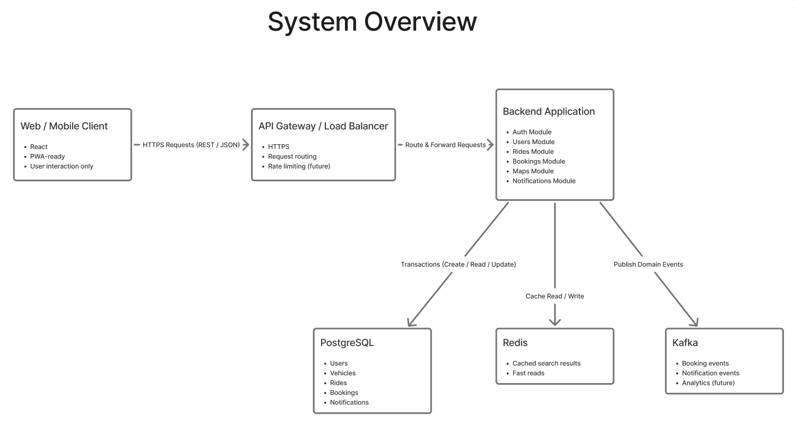

# Carpooling System (Vadodara-Halol Focus)

A production-inspired, modular monolith carpooling platform focused on the Vadodara (Baroda) to Halol corridor.

This project emphasizes correctness, concurrency safety, and reliable distributed workflows, while evolving toward corridor-specific product features, payments, and frontend applications.

## Problem We Are Solving

Daily commuters on the Vadodara-Halol route need travel that is:

- affordable
- reliable for repeated daily use
- better coordinated than ad-hoc ride finding

Existing mobility options are available, but this project targets a route-specific pooling experience for repeat commuters.

## Project Goals

- strong transactional guarantees
- concurrency-safe booking logic
- idempotent API design
- event-driven architecture
- reliable event delivery via Outbox pattern
- failure-aware system design

## Current Project Status (Already Done)

### Backend Core

- FastAPI modular monolith architecture
- PostgreSQL-backed transactional core flows
- Redis caching for ride search
- Kafka with Outbox pattern for reliable async events
- JWT authentication with HTTP-only cookie sessions
- Google Maps integration for coordinate-based ride creation and geo-search

### Business Flows

- user signup and login
- driver ride creation
- rider ride search (text-based and geo-based nearby search)
- coordinate-based ride creation via Google Maps
- booking creation
- booking cancellation
- booking history endpoint
- analytics overview endpoint

### Reliability and Correctness

- concurrency-safe seat booking (`SELECT FOR UPDATE`)
- idempotency support for booking retries
- event-driven side-effect architecture
- consumer idempotency handling
- health, readiness, and metrics endpoints

### Testing

- unit tests
- integration tests
- concurrency and race-condition tests
- API endpoint tests

## Current Focus (In Progress)

### Product Direction

- corridor-first experience for Vadodara-Halol commuters
- scheduled and recurring commute pooling
- trust and reliability features for daily riders and drivers

### Payment Direction

- platform-managed payment flow for commitment and settlement
- fixed driver-side commitment model
- rider fare based on distance slabs
- faster payout and refund processing after ride outcome

## Future Roadmap

### Phase 1: Corridor Operations

- predefined corridor stops
- distance slab pricing engine
- trip lifecycle states (`start`, `complete`, `cancel`)
- penalty and refund policy automation

### Phase 2: Payments and Settlement

- UPI payment integration
- escrow-style transaction tracking
- driver payout and refund orchestration
- payment ledger and reconciliation tools

### Phase 3: Frontend (Major Future Focus)

- rider application UI/UX (web/mobile)
- driver application UI/UX (web/mobile)
- corridor slot-based booking interface
- real-time trip status and settlement visibility
- OTP-first onboarding journey

### Phase 4: Scale and Trust

- advanced notifications (SMS/WhatsApp/push)
- dispute handling workflows
- operational dashboards and monitoring
- partnership-led growth expansion

## Architecture Overview

### Architecture Style: Modular Monolith

Chosen for:

- clear domain boundaries
- strong ACID guarantees
- operational simplicity
- evolution path toward microservices



```text
[ Client ]
     |
[ FastAPI Application ]
     |
[ PostgreSQL ]  <- Source of Truth
     |
[ Outbox Table ]
     |
[ Outbox Worker ]
     |
[ Kafka ]
     |
[ Consumers ]
```

## Core Design Philosophy

### PostgreSQL = Source of Truth

All critical business logic executes inside ACID transactions.

### Redis = Performance Layer

Used for read-through caching and performance optimization for ride search.

### Kafka = Asynchronous Side Effects

Used to decouple side effects (notifications, analytics, history) from core booking transactions.

### Outbox Pattern = Guaranteed Event Delivery

Events are written inside the same DB transaction and published asynchronously by a worker to avoid silent event loss.

### JWT = Stateless Authentication

Authentication is handled through HTTP-only cookie-based JWT sessions.

## System Modules

```text
app/
├── auth/        -> authentication and JWT
├── users/       -> user management
├── rides/       -> ride creation, text search, and geo-based nearby search
├── bookings/    -> booking lifecycle and idempotency
├── maps/        -> Google Maps API key endpoint
├── static/      -> frontend UI (maps.html)
├── outbox/      -> durable event storage
├── events/      -> consumer idempotency tracking
├── notifications/ -> notification attempt tracking
├── analytics/   -> KPI API
├── common/      -> DB, Redis, Kafka, metrics, middleware
├── config/      -> environment configuration

workers/
├── outbox_processor.py
├── booking_consumer.py
```

## Implemented Features

### Authentication

- signup and login
- password hashing
- JWT-based sessions
- HTTP-only cookies
- protected endpoints via dependency injection

### Ride Management

- drivers create rides with optional GPS coordinates
- passengers search rides by text or by geo-proximity (Haversine)
- indexed DB queries (text + coordinate indexes)
- Redis-backed caching

### Google Maps Integration

- Interactive map UI for picking source/destination coordinates
- Google Places Autocomplete for location search
- `GET /rides/nearby` geo-search using Haversine distance formula
- API key served securely from backend config
- Dark-themed map interface at `/static/maps.html`

### Transaction-Safe Booking

- ACID transactions
- `SELECT FOR UPDATE` row-level locking
- overbooking prevention under concurrency

### Idempotent Booking APIs

- unique idempotency keys
- concurrency-safe insert handling
- safe retries
- DB-level uniqueness constraints

### Booking Cancellation

- transactional seat restoration
- compensating event emission
- cache invalidation after cancellation

### Event System and Reliability

Events:

- `booking.confirmed`
- `booking.cancelled`
- `booking.dlq`

Reliability:

- producer retries
- consumer retry strategy with DLQ
- outbox-backed crash-safe publishing

## Failure Handling

- app crash during transaction -> automatic rollback
- duplicate booking request -> prevented by idempotency key
- Kafka publish failure -> retried via outbox worker
- consumer processing failure -> retry with DLQ fallback

## Current API Surface

### System

- `GET /healthz`
- `GET /readyz`
- `GET /metrics`

### Auth

- `POST /auth/signup`
- `POST /auth/login`

### Rides

- `POST /rides/` (supports optional `source_lat`, `source_lng`, `destination_lat`, `destination_lng`)
- `GET /rides/?source=...&destination=...`
- `GET /rides/nearby?lat=...&lng=...&radius_km=10&role=source` (geo-search)

### Maps

- `GET /maps/api-key` (returns Google Maps API key for frontend)

### Bookings

- `POST /bookings/` (requires `Idempotency-Key`)
- `POST /bookings/{booking_id}/cancel`
- `GET /bookings/history`

### Analytics

- `GET /analytics/overview?days=30`

## Local Setup

### 0) Configure Google Maps API key

Add your Google Maps API key to both `.env` files:

- `backend/.env` → set `GOOGLE_MAPS_API_KEY=your_key`
- Root `.env` → set `GOOGLE_MAPS_API_KEY=your_key`

Required Google Cloud APIs: **Maps JavaScript API**, **Places API**.

### 1) Start full stack (infra + backend services)

```bash
docker compose up -d --build
```

Starts PostgreSQL, Redis, Zookeeper, Kafka, API server, outbox worker, and booking consumer.

### 2) Verify services

```bash
docker compose ps
docker compose logs -f app outbox_worker booking_consumer
```

- API docs: `http://127.0.0.1:8000/docs`
- Map UI: `http://127.0.0.1:8000/static/maps.html`

### 3) Stop stack

```bash
docker compose down
```

### 4) Optional fallback (legacy local runner)

If needed, you can still run the old local script:

```bash
cd backend
./start_all.sh
```

## System Workflow

1. user authenticates
2. driver creates ride
3. passenger searches rides
4. passenger books ride (transaction-safe)
5. outbox event is written in same transaction
6. worker publishes event to Kafka
7. cancellation path emits compensating event

## Non-Goals (Current)

- no microservices split yet (modular monolith by design)
- no production-grade payment processing yet
- no full distributed tracing yet

## Tech Stack

- Backend: Python, FastAPI
- Database: PostgreSQL
- Cache: Redis
- Event Streaming: Kafka
- Maps: Google Maps JavaScript API + Places API
- Pattern: Modular Monolith + Outbox Pattern

## Why This Project

This system is designed as a correctness-first transportation backend, with practical handling for concurrency, retries, and asynchronous side effects. The next major milestone is converting this backend strength into a full corridor product with production-grade payments and frontend experience.
